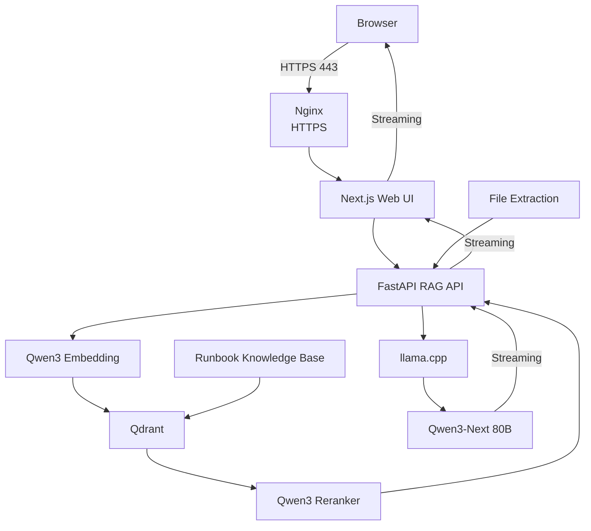

# 🚀 DevOps Runbooks AI

<p align="center">
  <strong>Private, production-ready AI assistant for Linux, Bare Metal and Infrastructure operations.</strong>
</p>

<p align="center">
  Local RAG · CPU-only inference · Open-source models · Automated Scaleway deployment
</p>

<p align="center">
  
  
  
  
  
  
  
</p>

---

## ✨ Overview

DevOps Runbooks AI is a private RAG platform designed for operational troubleshooting across Linux, Bare Metal, networking, storage and infrastructure environments.

The complete stack runs on Scaleway and uses local open-source models for embeddings, reranking and generation.

It combines a curated technical knowledge base with an interactive AI interface capable of handling conversational context, files, screenshots, configuration snippets, logs and source-backed troubleshooting.

The entire platform can be provisioned from scratch with:

```bash
make deploy
```

No manual configuration inside the server is required.

---

## ⚡ Features

- Private CPU-only AI inference
- Retrieval-Augmented Generation with Qdrant
- Linux and infrastructure-focused technical knowledge base
- Real-time streamed responses
- Multi-turn conversational context
- Source-backed answers
- Per-code-block copy buttons
- Full-response copy
- File analysis
- Screenshot OCR
- PDF and document extraction
- Source code and configuration file analysis
- Log analysis
- Browser voice dictation
- Request cancellation with Stop
- Automatic HTTPS
- IP-restricted application access
- Fully automated Terraform + Ansible deployment
- Idempotent redeployment
- Clean-room deployment support
- Automated health verification

---

## 🧠 AI Stack

| Component | Technology |
|---|---|
| Generation | Qwen3-Next-80B-A3B-Instruct |
| Quantization | GGUF Q4_K_M |
| Runtime | llama.cpp |
| Embeddings | Qwen3-Embedding-0.6B |
| Reranker | Qwen3-Reranker-4B |
| Vector database | Qdrant |
| API | FastAPI |
| Frontend | Next.js 16 |
| Reverse proxy | Nginx |
| Infrastructure | Terraform |
| Configuration | Ansible |
| Cloud | Scaleway |

All model inference runs locally on the Scaleway instance.

No commercial LLM API is required at runtime.

---

## 💬 Streaming Chat

Responses are streamed end-to-end:

```text
Qwen / llama.cpp
        │
        ▼
FastAPI StreamingResponse
        │
        ▼
Next.js streaming proxy
        │
        ▼
Browser ReadableStream
        │
        ▼
Progressive Markdown rendering
```

The answer appears progressively as it is generated instead of waiting for the complete model response.

The Stop button propagates request cancellation through the browser and HTTP streaming pipeline.

---

## 📎 File Analysis

The chat interface supports multiple file types.

Examples include:

| Category | Formats |
|---|---|
| Images | PNG, JPG, JPEG, WEBP |
| Documents | PDF, DOCX |
| Spreadsheets | XLSX, CSV |
| Data | JSON, YAML, XML |
| Text | TXT, Markdown, logs |
| Infrastructure | Terraform, HCL, TFVARS, INI, CONF |
| Code | Python, JavaScript, TypeScript, Shell, SQL and other common source formats |

Files are processed locally before their extracted content is provided to the RAG pipeline.

Images use local OCR when required.

Native text extraction is preferred whenever possible.

---

## 🏗️ Architecture



---

## 🔐 Security

The deployment follows a deliberately restricted network model.

Publicly reachable ports:

```text
22   SSH
80   HTTP / ACME
443  HTTPS
```

Internal services remain bound to loopback:

```text
127.0.0.1:3000   Next.js
127.0.0.1:8000   FastAPI
127.0.0.1:8080   llama.cpp
127.0.0.1:6333   Qdrant
```

Additional controls include:

- Scaleway Security Groups
- SSH restricted to the operator public `/32`
- Application access restricted by Nginx
- Automatic HTTPS
- TLS 1.2 / TLS 1.3
- HSTS
- Local model inference
- No direct public access to Qdrant
- No direct public access to llama.cpp
- No direct public access to FastAPI

---

## ☁️ Infrastructure

The platform is deployed on Scaleway using:

```text
Terraform
    │
    ├── Compute Instance
    ├── Flexible IPv4
    ├── Block Storage
    └── Security Group
            │
            ▼
        Ansible
            │
            ├── System packages
            ├── Docker
            ├── Qdrant
            ├── AI models
            ├── llama.cpp
            ├── RAG API
            ├── Next.js
            ├── Nginx
            ├── TLS
            └── systemd services
```

Persistent application data is stored under:

```text
/srv/devops-runbooks
```

---

## 🚀 Quick Start

### Requirements

The operator machine requires:

- macOS or Linux
- Terraform
- Python 3
- SSH
- curl
- valid Scaleway credentials

Ansible is automatically bootstrapped inside:

```text
.deploy-venv
```

### Deploy

Clone the repository:

```bash
git clone <repository-url>
cd DevOps-Runbooks
```

Then run:

```bash
make deploy
```

On the first deployment, the Scaleway Project ID can be requested interactively and stored locally.

Subsequent deployments reuse the local configuration.

The final application URL follows the Scaleway public FQDN format:

```text
https://<server-uuid>.pub.instances.scw.cloud
```

---

## 🔄 Deployment Flow

`make deploy` performs the complete deployment workflow:

```text
1. Terraform infrastructure
2. Scaleway DNS resolution
3. SSH readiness
4. cloud-init readiness
5. Ansible configuration
6. Docker / Qdrant setup
7. Model preparation
8. llama.cpp build
9. Knowledge-base indexing
10. API deployment
11. Next.js production build
12. Nginx configuration
13. Let's Encrypt certificate
14. systemd services
15. Application health checks
```

Long-running operations expose progress directly in the deployment terminal.

Model downloads and knowledge indexing are idempotent when existing resources can safely be reused.

---

## 🛠️ Operations

```bash
make deploy
```

Deploy or reconcile the complete platform.

```bash
make verify
```

Run end-to-end health checks.

```bash
make status
```

Display application services, memory and disk status.

```bash
make logs
```

Follow application logs.

```bash
make reindex
```

Force a fresh knowledge-base crawl, chunking and indexing process.

```bash
make access
```

Update SSH and Nginx access rules with the operator's current public IP.

```bash
make plan
```

Display the Terraform execution plan.

```bash
make destroy
```

Destroy the Scaleway infrastructure managed by Terraform.

---

## 🩺 Verification

A successful deployment can be validated with:

```bash
make verify
```

Expected components include:

```text
HTTPS / Web UI     ✓
Docker             ✓
Qdrant             ✓
LLM                ✓
RAG API            ✓
Next.js            ✓
Nginx              ✓
LLM service        ✓
RAG service        ✓
Web service        ✓
```

The deployment is designed to support the complete clean-room lifecycle:

```bash
make destroy
make deploy
make verify
```

without requiring manual server-side intervention.

---

## 📁 Repository Structure

```text
.
├── Makefile
│
├── apps/
│   ├── api/
│   │   ├── app.py
│   │   └── streaming.py
│   │
│   └── web/
│       ├── app/
│       └── lib/
│
├── services/
│   └── indexer/
│
├── infrastructure/
│   ├── terraform/
│   └── ansible/
│
├── scripts/
│
├── data/
│
├── docs/
│
└── README.md
```

---

## 📚 RAG Pipeline

The retrieval pipeline follows several stages:

```text
User question
      │
      ▼
Query embedding
      │
      ▼
Qdrant retrieval
      │
      ▼
Candidate filtering
      │
      ▼
Qwen3 reranking
      │
      ▼
Context construction
      │
      ▼
Qwen3-Next generation
      │
      ▼
Streaming response
```

Retrieved documentation sources are presented separately from the generated answer.

Internal source markers are removed from the user-facing response.

---

## 🔁 Reproducibility

Several components are explicitly pinned or controlled to improve reproducibility:

- Terraform provider versions through `.terraform.lock.hcl`
- Qdrant container version
- llama.cpp build
- Python dependencies
- Node dependencies through the lock file
- Model repositories and artifacts
- Infrastructure configuration through Terraform
- Host configuration through Ansible

Generated or machine-specific data is excluded from Git:

```text
terraform.tfstate
terraform.tfstate.*
terraform.tfvars
.deploy-venv/
.next/
node_modules/
model artifacts
generated indexes
local deployment data
```

---

## 🔒 TLS

The deployment automatically requests a Let's Encrypt certificate for the Scaleway public FQDN.

Example:

```text
https://<server-uuid>.pub.instances.scw.cloud
```

Before requesting the certificate, the deployment verifies that the FQDN resolves to the expected public IPv4 address.

Certificate renewal is handled automatically.

Nginx is reloaded after successful renewal.

HTTP traffic redirects to HTTPS.

---

## 🎙️ Voice Input

Voice dictation is available through supported browser speech-recognition capabilities.

The generated transcript remains editable before being submitted.

Browser speech recognition may rely on services provided by the browser vendor and should therefore not be considered part of the fully local inference pipeline.

---

## 🧩 Design Principles

This project follows a few core principles:

- Infrastructure as Code first
- No manual configuration on production instances
- Local-first AI inference
- Minimal public attack surface
- Reproducible deployments
- Idempotent automation
- Source-grounded AI responses
- Production-oriented troubleshooting
- Clear separation between infrastructure, application and AI layers

---

## 🗺️ Roadmap

Potential future improvements include:

- Additional technical knowledge bases
- More infrastructure domains
- Persistent conversation history
- Authentication and user management
- Advanced observability
- Metrics and tracing
- Additional document parsers
- Local speech-to-text
- Optional multimodal local vision model
- Multi-node deployment support

---

## 👨‍💻 Author

Built with infrastructure, automation and open-source AI in mind.

**Cheikh-GPT**