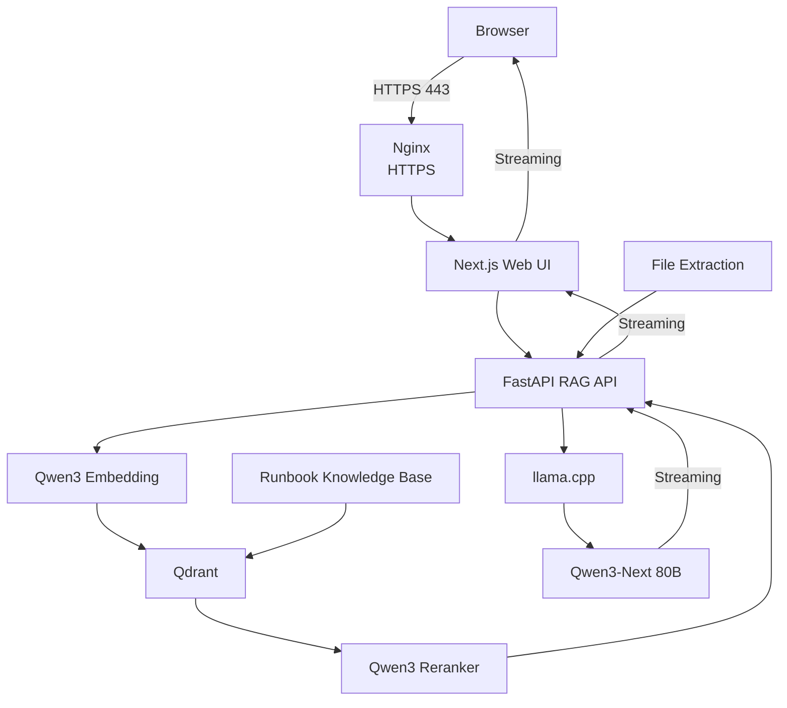

# 🚀 DevOps Runbooks AI

<p align="center">
  <strong>Private, production-ready AI assistant for Linux, Bare Metal and Infrastructure operations.</strong>
</p>

<p align="center">
  Local RAG · CPU-only inference · Open-source models · Automated Scaleway deployment
</p>

<p align="center">
  
  
  
  
  
  
  
</p>

---

## ✨ Overview

DevOps Runbooks AI is a private RAG platform designed for operational troubleshooting across Linux, Bare Metal, networking, storage and infrastructure environments.

The complete stack runs on Scaleway and uses local open-source models for embeddings, reranking and generation.

It combines a curated technical knowledge base with an interactive AI interface capable of handling conversational context, files, screenshots, configuration snippets, logs and source-backed troubleshooting.

The complete runner and application platform can be reconstructed with:

```bash
make deploy-all
```

Once the persistent runner exists, `make deploy` deploys or reconciles only the application stack through GitHub Actions.

No manual configuration inside the server is required.

---

## ⚡ Features

- Private CPU-only AI inference
- Retrieval-Augmented Generation with Qdrant
- Linux and infrastructure-focused technical knowledge base
- Real-time streamed responses
- Multi-turn conversational context
- Source-backed answers
- Per-code-block copy buttons
- Full-response copy
- File analysis
- Screenshot OCR
- PDF and document extraction
- Source code and configuration file analysis
- Log analysis
- Browser voice dictation
- Request cancellation with Stop
- Automatic HTTPS
- IP-restricted application access
- Fully automated Terraform + Ansible deployment through GitHub Actions
- Persistent Scaleway self-hosted deployment runner
- Independent application and runner Terraform stacks with remote state
- Idempotent redeployment
- Validated full-platform clean-room reconstruction
- Automated health verification

---

## 🧠 AI Stack

| Component | Technology |
|---|---|
| Generation | Qwen3-Next-80B-A3B-Instruct |
| Quantization | GGUF Q4_K_M |
| Runtime | llama.cpp |
| Embeddings | Qwen3-Embedding-0.6B |
| Reranker | Qwen3-Reranker-4B |
| Vector database | Qdrant |
| API | FastAPI |
| Frontend | Next.js 16 |
| Reverse proxy | Nginx |
| Infrastructure | Terraform |
| Configuration | Ansible |
| Cloud | Scaleway |

All model inference runs locally on the Scaleway instance.

No commercial LLM API is required at runtime.

---

## 💬 Streaming Chat

Responses are streamed end-to-end:

```text
Qwen / llama.cpp
        │
        ▼
FastAPI StreamingResponse
        │
        ▼
Next.js streaming proxy
        │
        ▼
Browser ReadableStream
        │
        ▼
Progressive Markdown rendering
```

The answer appears progressively as it is generated instead of waiting for the complete model response.

The Stop button propagates request cancellation through the browser and HTTP streaming pipeline.

---

## 📎 File Analysis

The chat interface supports multiple file types.

Examples include:

| Category | Formats |
|---|---|
| Images | PNG, JPG, JPEG, WEBP |
| Documents | PDF, DOCX |
| Spreadsheets | XLSX, CSV |
| Data | JSON, YAML, XML |
| Text | TXT, Markdown, logs |
| Infrastructure | Terraform, HCL, TFVARS, INI, CONF |
| Code | Python, JavaScript, TypeScript, Shell, SQL and other common source formats |

Files are processed locally before their extracted content is provided to the RAG pipeline.

Images use local OCR when required.

Native text extraction is preferred whenever possible.

---

## 🏗️ Architecture



---

## 🔐 Security

The deployment follows a deliberately restricted network model.

Application VM ingress ports:

```text
22   SSH
80   HTTP / ACME
443  HTTPS
```

Internal services remain bound to loopback:

```text
127.0.0.1:3000   Next.js
127.0.0.1:8000   FastAPI
127.0.0.1:8080   llama.cpp
127.0.0.1:6333   Qdrant
```

Additional controls include:

- Scaleway Security Groups
- Application VM SSH restricted to the operator public `/32` and self-hosted runner public `/32`
- Runner VM SSH restricted to the operator public `/32`
- Dedicated Security Groups for the application and runner
- Application access restricted by Nginx
- Automatic HTTPS
- TLS 1.2 / TLS 1.3
- HSTS
- Local model inference
- No direct public access to Qdrant
- No direct public access to llama.cpp
- No direct public access to FastAPI

---

## ☁️ Infrastructure

The platform has two independent Terraform stacks on Scaleway:

| Stack | Directory | Managed resources |
|---|---|---|
| Application | `infrastructure/terraform/` | Large Compute instance for AI/RAG, Flexible IPv4, Block Storage and application Security Group |
| Runner | `infrastructure/terraform-runner/` | Persistent GitHub Actions runner Compute instance, dedicated public IPv4 and dedicated Security Group |

The self-hosted runner is registered in GitHub as `scaleway-devops-runbooks-01`. It remains available when the application stack is destroyed, so subsequent application deployments can reuse it.

```text
GitHub
    │
    ▼
Scaleway self-hosted GitHub Actions runner
    │
    ▼
Terraform application stack
    │
    ├── Compute instance
    ├── Flexible IPv4
    ├── Block Storage
    └── Application Security Group
            │
            ▼
        Ansible
            │
            ├── System packages
            ├── Docker / Qdrant
            ├── AI models / llama.cpp
            ├── RAG API / Next.js
            ├── Nginx / TLS
            └── systemd services
                    │
                    ▼
            Production AI/RAG VM
```

### Remote Terraform state

Both stacks use an S3-compatible backend in Scaleway Object Storage, with separate state keys:

| Stack | Remote state key |
|---|---|
| Application | `production/terraform.tfstate` |
| Runner | `runner/terraform.tfstate` |

The state bucket is outside the resources destroyed by either lifecycle. Both `make destroy` and `make destroy-all` intentionally preserve it. Destroying a stack updates its remote state; it does not delete the remote-state backend.

Persistent application data is stored on the application VM under:

```text
/srv/devops-runbooks
```

Application destruction includes its data volume. Preserving the Terraform state bucket does not preserve application data.

---

## 🚀 Quick Start

### Requirements

The operator machine requires:

- macOS or Linux
- Git and Terraform
- Python 3
- SSH and curl
- GitHub CLI (`gh`), authenticated for this repository with workflow and runner-management access
- Scaleway CLI (`scw`) and jq
- Valid Scaleway credentials with access to the required Compute resources and Object Storage backend

Before the first full deployment, configure the existing remote-state backend and local application `terraform.tfvars` with your project selection. Runner bootstrap reads this local configuration; it does not prompt for a missing project selection. Keep machine-specific values out of Git.

The deployment SSH key pair must be available locally for runner bootstrap. Configure the GitHub `production` environment with the Scaleway credentials, project selection, deployment SSH private key and `OPERATOR_CIDR`. Runner bootstrap installs and registers the runner, ensures its public SSH key is registered in Scaleway, and sets `RUNNER_CIDR` in that environment.

Ansible is installed by the production workflow. The local deployment helper bootstraps its own Ansible environment in `.deploy-venv` when used.

### Clone

```bash
git clone https://github.com/CheikhAiLabs/DevOps-Runbooks.git
cd DevOps-Runbooks
```

### First or full deployment

With the credentials and backend configured, create or reconcile the runner and application stacks:

```bash
make deploy-all
```

This bootstraps the runner, waits until GitHub reports it online, dispatches **Deploy Production**, waits for completion and runs application verification through the workflow.

### Normal application deployment

Once the runner exists and is online:

```bash
make deploy
```

This deploys or reconciles only the application stack using the existing runner. In a GitHub-connected, authenticated checkout, the command dispatches the workflow or offers to commit and push local changes, then waits for the deployment. Commit/push actions require confirmation.

The Makefile retains a local application-deployment fallback when GitHub CLI integration is unavailable. The validated production path uses GitHub Actions; the fallback does not provision the runner.

### Application URL

Both deployment commands print the final Application URL locally:

```text
https://<server-uuid>.pub.instances.scw.cloud
```

The same URL appears in the GitHub Actions **Deployment Summary** and workflow logs.

---

## 🔄 Deployment Flow

### Application only — `make deploy`

```text
Workstation
    → GitHub Deploy Production workflow
    → Existing Scaleway self-hosted runner
    → Terraform application stack
    → Ansible
    → End-to-end verification
    → Application URL
```

### Full platform — `make deploy-all`

```text
Workstation
    → Terraform runner stack
    → Runner VM and SSH readiness
    → Runner installation and GitHub registration
    → Runner online
    → GitHub Deploy Production workflow
    → Terraform application stack
    → Ansible
    → End-to-end verification
    → Application URL
```

The application deployment provisions the VM, public IPv4, data volume and Security Group; waits for SSH and cloud-init; installs Docker/Qdrant; prepares models; builds llama.cpp; indexes the knowledge base; deploys the API and Next.js; configures Nginx, DNS readiness, HTTPS and systemd; and runs health checks.

Long-running operations expose progress in workflow logs. `scripts/watch-deploy.sh` waits for GitHub deployment completion and returns the final Application URL to the local terminal.

Model downloads and knowledge indexing are idempotent when existing resources can safely be reused.

---

## 🔧 GitHub Actions / CI/CD

| Configuration | Purpose |
|---|---|
| `.github/workflows/ci.yml` | Validate changes on pull requests, pushes to `main`, or manual dispatch |
| `.github/workflows/deploy.yml` | **Deploy Production** on deployment-related pushes to `main` or manual dispatch |
| `.github/workflows/destroy.yml` | Manually destroy the application stack after the required confirmation |
| `.github/dependabot.yml` | Weekly dependency updates for GitHub Actions, npm and Python |

CI runs Terraform format and validation checks for the application stack, Python compilation, a Next.js production build, Ansible syntax checks, Bash syntax checks and ShellCheck.

CI validation jobs use GitHub-hosted Ubuntu runners. Production deployment and the production destroy workflow use the persistent Scaleway self-hosted runner, selected by the `self-hosted`, `linux`, `x64` and `devops-runbooks` labels. They do not depend on an ephemeral GitHub-hosted deployment runner.

Production workflows use the GitHub `production` environment and serialize deployment/destruction through the same concurrency group. Deployment runs Terraform, Ansible and verification, then publishes the status and Application URL in its summary and logs.

---

## 🛠️ Operations

The four primary lifecycle commands have separate scopes:

| Command | Scope | Behavior |
|---|---|---|
| `make deploy` | Application stack only | Use the existing runner to deploy/reconcile through GitHub, wait for completion and print the Application URL |
| `make deploy-all` | Runner + application stack | Create/reconcile and register the runner, wait until it is online, deploy the application through GitHub, verify and print the Application URL |
| `make destroy` | Application stack only | Destroy application resources, including the data volume; keep the runner and remote-state bucket |
| `make destroy-all` | Application + runner stacks | Destroy the application first, remove the GitHub runner registration, then destroy runner infrastructure; preserve the remote-state bucket |

`make destroy-all` requires the `DESTROY-ALL` confirmation and removes the `RUNNER_CIDR` variable from the GitHub `production` environment when present and accessible. `make destroy` invokes the application Terraform destroy helper locally; the separate **Destroy Production** workflow provides an application-only GitHub Actions path.

Other operational commands remain available:

| Command | Purpose |
|---|---|
| `make verify` | Run end-to-end application health checks |
| `make status` | Display application services, memory and disk status |
| `make logs` | Follow application logs |
| `make reindex` | Force a fresh knowledge-base crawl, chunking and indexing process |
| `make access` | Update SSH and Nginx access rules for the operator's current public IP |
| `make plan` | Validate and display Terraform plans for both runner and application stacks |

---

## 🩺 Verification

Application verification runs during production deployment and can also be invoked locally:

```bash
make verify
```

The checks cover:

```text
DNS                   ✓
HTTPS / Web UI        ✓
Docker                ✓
Qdrant                ✓
LLM                   ✓
RAG API               ✓
Next.js               ✓
Nginx                 ✓
LLM systemd service   ✓
RAG systemd service   ✓
Web systemd service   ✓
```

### Validated clean-room lifecycle

The following full-platform lifecycle has been tested successfully:

```bash
make destroy-all
make deploy-all
make verify
```

The validated run destroyed the application stack and runner infrastructure, removed the GitHub runner registration, and preserved the Object Storage remote-state backend. It then recreated and re-registered the runner, reconstructed the application stack from zero through Terraform and Ansible, passed all health checks, and returned the final Scaleway FQDN.

No manual server-side intervention was required. Application-only redeployments reuse the persistent runner; the full lifecycle validates reconstruction of both stacks.

---

## 📁 Repository Structure

```text
.
├── Makefile
│
├── .github/
│   ├── workflows/
│   │   ├── ci.yml
│   │   ├── deploy.yml
│   │   └── destroy.yml
│   └── dependabot.yml
│
├── apps/
│   ├── api/
│   │   ├── app.py
│   │   ├── file_extraction.py
│   │   └── streaming.py
│   │
│   └── web/
│       ├── app/
│       └── lib/
│
├── services/
│   └── indexer/
│
├── infrastructure/
│   ├── terraform/
│   ├── terraform-runner/
│   └── ansible/
│
├── scripts/
│   ├── bootstrap-runner.sh
│   ├── deploy-all.sh
│   ├── deploy.sh
│   ├── destroy-all.sh
│   ├── destroy.sh
│   ├── verify.sh
│   └── watch-deploy.sh
│
├── data/
│
├── docs/
│
└── README.md
```

---

## 📚 RAG Pipeline

The retrieval pipeline follows several stages:

```text
User question
      │
      ▼
Query embedding
      │
      ▼
Qdrant retrieval
      │
      ▼
Candidate filtering
      │
      ▼
Qwen3 reranking
      │
      ▼
Context construction
      │
      ▼
Qwen3-Next generation
      │
      ▼
Streaming response
```

Retrieved documentation sources are presented separately from the generated answer.

Internal source markers are removed from the user-facing response.

---

## 🔁 Reproducibility

Several components are explicitly pinned or controlled to improve reproducibility:

- Terraform provider versions through `.terraform.lock.hcl`
- Qdrant container version
- llama.cpp build
- Python dependencies
- Node dependencies through the lock file
- Model repositories and artifacts
- Infrastructure configuration through Terraform
- Host configuration through Ansible

The application and runner are reconciled independently, with separate remote states in Scaleway Object Storage: `production/terraform.tfstate` and `runner/terraform.tfstate`. Normal application redeployment reuses the runner, while `make deploy-all` reconciles both stacks.

The remote-state bucket survives all destroy commands, including `make destroy-all`. The successfully tested `make destroy-all` → `make deploy-all` → `make verify` lifecycle demonstrates complete runner and application reconstruction while retaining the state backend.

Local state copies, generated files and machine-specific data are excluded from Git:

```text
terraform.tfstate
terraform.tfstate.*
terraform.tfvars
.deploy-venv/
.next/
node_modules/
model artifacts
generated indexes
local deployment data
```

---

## 🔒 TLS

The deployment automatically requests a Let's Encrypt certificate for the Scaleway public FQDN.

Example:

```text
https://<server-uuid>.pub.instances.scw.cloud
```

Before requesting the certificate, the deployment verifies that the FQDN resolves to the expected public IPv4 address.

Certificate renewal is handled automatically.

Nginx is reloaded after successful renewal.

HTTP traffic redirects to HTTPS.

---

## 🎙️ Voice Input

Voice dictation is available through supported browser speech-recognition capabilities.

The generated transcript remains editable before being submitted.

Browser speech recognition may rely on services provided by the browser vendor and should therefore not be considered part of the fully local inference pipeline.

---

## 🧩 Design Principles

This project follows a few core principles:

- Infrastructure as Code first
- No manual configuration on production instances
- Local-first AI inference
- Minimal public attack surface
- Reproducible deployments
- Idempotent automation
- Source-grounded AI responses
- Production-oriented troubleshooting
- Clear separation between infrastructure, application and AI layers

---

## 🗺️ Roadmap

Potential future improvements include:

- Additional technical knowledge bases
- More infrastructure domains
- Persistent conversation history
- Authentication and user management
- Advanced observability
- Metrics and tracing
- Additional document parsers
- Local speech-to-text
- Optional multimodal local vision model
- Multi-node deployment support

---

## 👨‍💻 Author

Built with infrastructure, automation and open-source AI in mind.

— *Cheikh-GPT*
